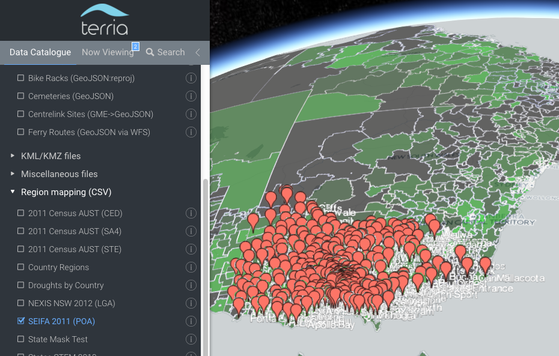

[](https://travis-ci.org/TerriaJS/TerriaMap)

Terria Map
==========


Terria Map is a free web-based geospatial visualisation platform that drives [http://nationalmap.gov.au](National Map), [nationalmap.gov.au/renewables](AREMI), [NEII Viewer](neiiviewer.nicta.com.au) and other map-based sites. It can handle catalogs of thousands of layers, with dozens of geospatial file and web service types supported. It is almost entirely JavaScript in the browser, meaning it can even be deployed as a static website, making it simple and cheap to host.

### Features

* Nested catalog of layers which can be independently enabled to create mashups of many layers.
* Supports GeoJSON, KML, CSV (point and region-mapped), GPX and CZML file types natively, and others including zipped shapefiles with an optional server-side conversion service.
* Supports WMS, WFS, Esri MapServer, ABS ITT, Bing Maps, OpenStreetMap-style raster tiles, Mapbox, Urthecast, and WMTS item types.
* Supports querying WMS, WFS, Esri MapServer, CSW, CKAN and Socrata services for groups of items.
* 3D globe (Cesium) or 2D mode (Leaflet). 3D objects supported in CZML format.
* Time dimensions supported for CSV, CZML, WMS. Automatically animate layers, or slide the time control forward and backward.
* Drag-and-drop files from your desktop the browser, for instant visualisation (no file upload to server required).
* All ASGS region types (LGA, SA2, commonwealth electoral district etc) supported for [CSV region mapping](https://github.com/NICTA/nationalmap/wiki/csv-geo-au), plus several others: Primary Health Networks, Statistical Local Areas, ISO 3 letter country codes, etc.




### Technical

* Built in Ecmascript 2015, compiled with Babel to ES5 using Gulp.
* Supports IE9 and later.
* [TerriaJS Server component](https://github.com/TerriajS/TerriaJS-Server) runs in NodeJS and provides proxying for web services that don't support CORS or require authentication.
* Dependencies are [managed in NPM](https://www.npmjs.com/~terria) and assembled using WebPack.

### Getting Started ###
Pre-requisites: Git, NodeJS, NPM, GDAL (optional).
 
```
sudo npm install -g gulp                           # Install gulp, the build tool
git clone https://github.com/TerriaJS/TerriaMap    # Get the code
cd TerriaMap                                       
npm install                                        # Install dependencies
npm start                                          # Start the server in the background
gulp watch                                         # Build the site, and watch for changes.
```

Now visit the site in your browser at `http://localhost:3001`.
 
See the [wiki](https://github.com/NICTA/nationalmap/wiki) for more detailed information about how to build and run it.
