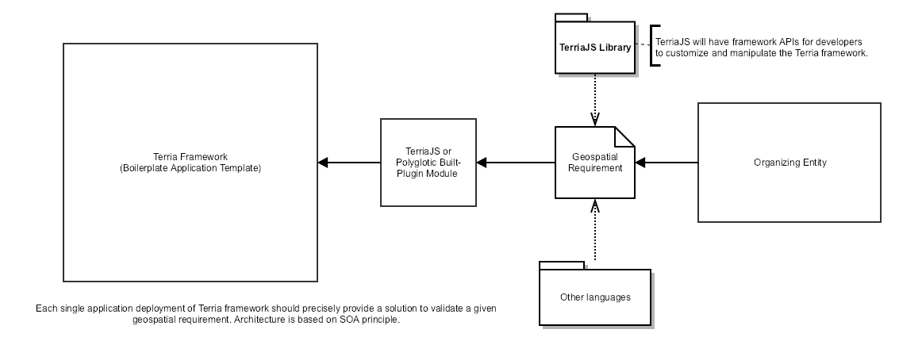

Terria Framework
==========


[](https://greenkeeper.io/)

Forked development from TerriaJS/TerriaMap for a new boilerplate cms framework based on TerriaJS with backend functionality for managing modules such as TerriaJS Catalog and other data as well as addon/plugin system for extensibility. The framework is based on an initiative to provide government agencies, research institution and space operations the capability to manage and visualize their data on a powerful, polyglotic and scalable geospatial computing framework.

This is a complete website built using the TerriaJS library. See the [TerriaJS README](https://github.com/TerriaJS/TerriaJS) for information about TerriaJS, and getting started using this repository.

## Repository Status

Currently under rough development. The repository is being refactored and merge with terriajs-server to develop a full-stack framework using TerriaJS modules with module management.

## Draft Architecture Plan



The boilerplate application template is just a space background with stars with the necessary buttons like the feedback button and copyrights currently in the TerriaMap template.

Terria Framework is a javascript application that renders UI panels/layers/models/animations and performs processes via TerriaJS Library. Essentially the framework runs on top of a plugin javascript module that specifies how the framework behaves.

The framework runs the whole thing and renders the application process to validate the geospatial requirement.

Initially, the framework will be a blank slate with space/stars background. The framework then reads the instructions from TerriaJS/Polyglotic codebase and renders it.	

An example code would be to render a planet model with scanned tiles data.

```js

'use strict';

import Earth from 'terriajs/lib/models/earth';
import Panel from 'terriajs/lib/ui/panel';
import terriaJSCatalog from 'terriajs/lib/prebuilt/catalog';
import ckan from 'terriajs/lib/connectors/ckan';
import MyModule from 'myfiles/mymodule.js';
import geocodingService from 'terriajs/lib/services/geocoder';

var earth = new Earth(); // This should render Earth on top of the space/stars background when the framework starts.

var regions = function() {
	
	dataLayer = ... // get regions data here

	return dataLayer; // Probably a json data

}

earth.addLayer(regions); // Adds the regions

var catalog = new terriaJSCatalog(); // Renders the catalog UI and its functionalities.
var ckan = new ckan();
catalog.init(); // Reads the catalog initialization file
catalog.addGroup(ckan); // Adds a catalog group, just an example. Object options are omitted.

var smallPanel = new Panel(x-position,y-position,height,width); // Renders a small panel in the x,y position in the browser screen.

smallPanel.addModule(MyModule); // Module will run on the panel when the framework starts. myModule is a javascript polyglotic module that runs other languages/script files or codebase using a library called 'terriajs/lib/polyglotic/java' for java or something else.

var geocoder = new geocodingService(...); // New instance of geocoder for boundary lookup service reverse and forward.

var geocoderPanel = new Panel(...);

geocoderPanel.addModule(geocoder.attachedUI()); // Runs the geocoding service UI.

... // Other things, tasks, or processes.

Later, we will have a single TerriaJS library object.

const terriajs = require('terriajs');

var module = terriajs.module;
var anothermodule = terriajs.anothermodule;
var service = terriajs.servicename; //  Which are really still javascript modules but it makes more sense to call them services.

/*
Every module/class should be an independent javascript module such that the modules should still run on the static browser aside from the framework environment that it will be loaded into. Each module should be independent and have its own UI and functionalities built into them. Essentially having React component built into the module to render its UI somehow like an <iframe> which makes up the panel but probably better. We'll probably extend iframe's functionality for civilian use.

Obcourse without data source and backend stuff then the react component has to get the data statically embedded in the source code or json file.

More into this later on.
*/
		
```

The framework should be able to handle running scripts from other languages via public endpoints and/or a Javascript module in TerriaJS as things will be developed and built for the geospatial industry such as CKANnext in python that needs to be run inside the application process but in a different language.

## Directory Files and Structure

[To be written]

_foldername - Developer only folder